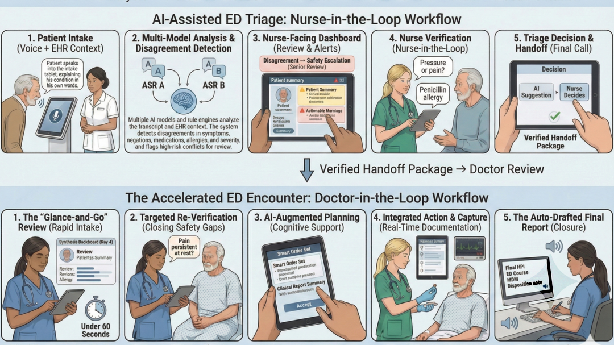

<div align="center">

# Triage Medley

**A human-in-the-loop clinical decision support system that uses multi-model disagreement as a safety signal for emergency department triage.**

[](https://arxiv.org/abs/2508.21648)
[](https://triage.medleyai.org/)
[](https://python.org)
[](https://streamlit.io)
[](LICENSE)

[Live Demo](https://triage.medleyai.org/) · [Paper](https://arxiv.org/abs/2508.21648) · [Architecture](docs/ARCHITECTURE.md) · [Video Walkthrough](#-video-demos)

</div>

---

<p align="center">
  
</p>

<p align="center"><em>AI-Assisted ED Triage — from patient voice intake through multi-model analysis to nurse-verified handoff and physician decision support.</em></p>

---

## Overview

Triage Medley implements the [MEDLEY framework](https://arxiv.org/abs/2508.21648) (Medical Ensemble Diagnostic system with Leveraged diversitY) — a system where **disagreement between AI models is preserved as a clinical resource, not collapsed into consensus**.

In emergency departments, triage errors — both over-triage and under-triage — contribute to delayed treatment and adverse outcomes. Current AI-assisted triage systems typically produce a single prediction, hiding the uncertainty that clinicians need to make informed decisions.

Triage Medley takes a different approach:

- **Multiple AI models and rule engines** independently assess each patient
- **Disagreement is surfaced**, not suppressed — when models disagree on severity, the system flags the case for senior review
- **"Don't-miss" diagnoses** from any single model are elevated regardless of consensus
- **The clinician always decides** — the system provides structured evidence, not automated decisions

### Why This Matters

| Problem | How Triage Medley Addresses It |
|---------|-------------------------------|
| Single-model AI hides uncertainty | Ensemble of 5 LLMs + 3 rule engines makes disagreement visible |
| Triage errors in high-volume EDs | Two-stage pipeline (pre-triage in <60s, full triage with vitals) accelerates safe assessment |
| Dangerous "don't-miss" conditions can be overlooked | Any model flagging a critical diagnosis triggers an alert, regardless of majority opinion |
| AI suggestions lack auditability | Every model output, human override, and clinical decision is logged to an append-only audit trail |

---

## 🔗 Live Demo

**→ [triage.medleyai.org](https://triage.medleyai.org/)**

The live demo includes 6 synthetic patient scenarios covering a range of clinical complexity — from a pediatric meningitis case to an elderly patient with medication-masked sepsis. You can:

- Walk through the **patient intake kiosk** (voice-to-text simulation)
- Review the **priority queue** as a charge nurse
- Enter vitals and see the **multi-model ensemble triage result** with disagreement analysis
- Examine the **physician handoff view** with differential diagnosis and management plans
- Download **PDF triage reports**

> **Demo credentials:** Nurse (`nurse_anna` / `1234`), Physician (`dr_nilsson` / `5678`), Admin (`admin` / `0000`). Patient role requires no login.

---

## 🎥 Video Demos

| Video | Description |
|-------|-------------|
| ▶️ [**Full System Walkthrough**](https://www.youtube.com/watch?v=Rc7Or94kE5o) | End-to-end demonstration: patient arrival → kiosk intake → nurse triage → physician handoff |
| ▶️ [**Technical Deep Dive**](https://www.youtube.com/watch?v=iVhg4jCdJ9s&t=36s) | MEDLEY framework architecture, ensemble logic, and disagreement analysis |

---

## How It Works

Triage Medley operates as a **two-stage pipeline** with a strict type-level separation: Stage A runs without vitals, Stage B requires them.

### Stage A — Pre-Triage (< 60 seconds, no vitals)

1. **Patient speaks** at a walk-in kiosk (or arrives via referral/ambulance)
2. **Dual-ASR processing** transcribes speech; word-level disagreements between ASR systems are flagged
3. **EHR lookup** retrieves active conditions, medications, allergies, and computes risk flags (e.g., immunosuppression + infection risk)
4. **Pre-triage engine + MedGemma 4B** assign an initial queue priority (HIGH / MODERATE / STANDARD)

### Stage B — Full Triage (with vitals)

5. **Nurse enters vital signs** (HR, BP, RR, SpO₂, Temperature, consciousness level)
6. **Three rule engines run in parallel:**
   - **RETTS** — Swedish ED standard (vitals + ESS category → colour level)
   - **ESI** — 5-level acuity with resource prediction
   - **MTS** — Manchester Triage System flowchart discriminators
7. **Five LLMs run in parallel** via `ThreadPoolExecutor`:
   - MedGemma 4B, MedGemma 27B, Meditron-7B, QwenMed, BioMistral
8. **Agreement Engine** analyzes ensemble outputs:
   - Classifies consensus: FULL / PARTIAL / NONE
   - Final triage level = **most severe** across all voters
   - Aggregates don't-miss diagnoses from **all** models (union, not intersection)
   - Flags cases for **senior review** when models disagree or a minority escalates severity

### Output

The system produces three structured outputs per patient:

- **Triage Assessment** — RETTS colour level with vote distribution, escalation alerts, and don't-miss warnings
- **Differential Diagnosis** — Three-tier ranking: primary (≥80% consensus), alternative (40–79%), minority/devil's advocate (<40%)
- **Management Plan** — Consensus investigations, imaging, medications, disposition with per-model reasoning

> **Core principle:** Disagreement is never hidden. If one model out of eight flags a life-threatening condition, the clinician sees it.

<p align="center">
  
</p>

<p align="center"><em>Triage View — ensemble consensus (ORANGE), EHR-derived risk flags, don't-miss diagnoses, and rule engine evidence for a 79-year-old patient with immunosuppression and medication-masked vitals.</em></p>

---

## Quick Start

### 1. Install

```bash
git clone https://github.com/ki-smile/triage-medley.git
cd triage-medley
pip install -r requirements.txt
```

### 2. Run (Mock Mode — No API Keys Required)

```bash
streamlit run app.py
```

The app runs with **mock adapters** by default — all AI model responses are simulated using pre-built scenario data for 6 patients. No HuggingFace account or API keys are needed to explore the full UI and workflow.

### 3. Run Tests

```bash
pytest tests/ -v
```

> **Need live model inference?** See the [HuggingFace Integration Guide](docs/HUGGINGFACE_SETUP.md) for connecting to real models via HF Inference API or Spaces.

---

## Demo Credentials

| Username | PIN | Role |
|----------|-----|------|
| `nurse_anna` | `1234` | Triage Nurse |
| `nurse_erik` | `1234` | Triage Nurse |
| `dr_nilsson` | `5678` | Physician |
| `dr_berg` | `5678` | Physician |
| `admin` | `0000` | Admin |

Patient role requires no login.

---

## Repository Structure

```
triage-medley/
├── app.py                        # Streamlit entry point (role-based navigation)
├── requirements.txt              # Python dependencies
│
├── config/
│   ├── models.yaml               # Model registry + adapter selection (mock | huggingface | space)
│   ├── engines.yaml              # Multi-engine configuration (RETTS, ESI, MTS)
│   ├── pretriage.yaml            # Pre-triage priority rules
│   ├── prompts/                  # YAML prompt templates (per pipeline stage)
│   ├── retts/                    # RETTS clinical rules (ESS codes, vital thresholds)
│   ├── esi/                      # ESI decision tree + resource rules
│   └── mts/                      # MTS flowcharts + general discriminators
│
├── src/
│   ├── models/                   # Pydantic data models (clinical, context, outputs, vitals)
│   ├── adapters/                 # ModelAdapter protocol + implementations (mock, HF, Space)
│   ├── engines/                  # Deterministic rule engines (RETTS, ESI, MTS, pre-triage, agreement)
│   ├── services/                 # Application services (ASR, auth, EHR, orchestrator, PDF)
│   └── utils/                    # Audit logger, config loader, theme
│
├── pages/                        # Streamlit multi-page app
│   ├── 0_Kiosk.py                # Patient self-arrival kiosk
│   ├── 1_Queue_View.py           # Charge nurse: priority-ordered waiting room
│   ├── 2_Triage_View.py          # Triage nurse: vitals entry → ensemble result
│   ├── 3_Physician_View.py       # Physician: differential + management handoff
│   ├── 4_Prompt_Editor.py        # Dev tool: live YAML prompt editing
│   ├── 5_Audit_Log.py            # Compliance: full decision trail
│   └── 6_Engine_Config.py        # Admin: engine selection + API key config
│
├── data/
│   ├── scenarios/                # Mock JSON responses (6 patients × 4 stages × models)
│   ├── ehr/                      # Synthetic FHIR R4 patient bundles
│   └── audit/                    # Audit log output (audit.jsonl)
│
├── tests/                        # Pytest suite (adapters, engines, pipeline, models, services)
└── docs/
    ├── ARCHITECTURE.md           # Detailed technical architecture with Mermaid diagrams
    └── HUGGINGFACE_SETUP.md      # Step-by-step guide for live model inference
```

---

## Method Summary

Triage Medley is the clinical triage implementation of the **MEDLEY** framework, described in:

> **TRIAGE-MEDLEY: Ensemble Triage Decision Support Using MedGemma and the MEDLEY Disagreement Framework**  
> 

The core insight is that **bias in medical AI is conventionally treated as a defect, but disagreement between diverse models can be a clinically informative signal**. Rather than training one better model or averaging predictions, MEDLEY:

1. **Preserves individual model outputs** — each model's triage level, differential, and management plan are visible to the clinician
2. **Treats disagreement as an escalation trigger** — if models disagree, that case requires more careful review
3. **Uses "devil's advocate" models** — BioMistral is specifically included to surface low-probability, high-consequence diagnoses that consensus models might suppress
4. **Combines deterministic and probabilistic reasoning** — three rule engines (RETTS, ESI, MTS) provide reproducible baselines; LLMs provide nuanced clinical reasoning

The system operates on synthetic FHIR patient data and mock model responses in its current form. Prospective clinical validation has not been conducted.

---

## Included Scenarios

The system ships with 6 synthetic patient scenarios designed to exercise different clinical pathways:

| Patient | Age/Sex | Key Challenge |
|---------|---------|---------------|
| **Ingrid** | 79F | Immunosuppressed, medication-masked vitals, deceptively normal presentation |
| **Erik** | 68M | Acute chest pain, aortic dissection vs. ACS differentiation |
| **Ella** | 4F | Pediatric meningococcal sepsis, rapid deterioration risk |
| **Sofia** | 34F | Young woman, atypical presentation, diagnostic uncertainty |
| **Anders** | 52M | Multi-system complaints, comorbidity interactions |
| **Margit** | 71F | Elderly polypharmacy, fall risk assessment |

---

## Limitations

- **Not a validated clinical tool.** Triage Medley is a research prototype and proof-of-concept demonstrator. It has not undergone prospective clinical validation or regulatory review.
- **Synthetic data only.** All patient scenarios use synthetic FHIR bundles generated with Synthea. No real patient data is used or stored.
- **Mock model responses.** The default mode uses pre-generated JSON responses, not live model inference. Live inference requires HuggingFace API access and is subject to model availability and latency.
- **Single-language focus.** The system is designed for Swedish emergency departments and uses RETTS as the primary triage framework. ESI and MTS are included for cross-system comparison but are secondary.
- **No speech-to-text in demo.** The dual-ASR pipeline is simulated; real ASR integration is not included in this release.
- **Ensemble composition is fixed.** The current model selection (MedGemma, Meditron, BioMistral) reflects availability at time of development, not an optimized ensemble selection.

---

## Future Work

- **Prospective validation** with de-identified clinical data in a Swedish ED setting
- **Real-time ASR integration** with medical-domain speech recognition models
- **Adaptive ensemble selection** — choosing models based on presenting complaint
- **FHIR R4 integration** with hospital EHR systems for live patient data
- **Multilingual support** — extending beyond Swedish/English
- **Regulatory pathway** — CE marking assessment for clinical decision support software

---

## Citation

If you use Triage Medley or the MEDLEY framework in your research, please cite:

```bibtex
@article{medley2025,
  title     = {TRIAGE-MEDLEY: Ensemble Triage Decision Support Using MedGemma and the MEDLEY Disagreement Framework},
  author    = {Abtahi, Farhad and Afdideh, Fardin and Illueca Fernandez, Eduardo
               and Karbalaie, Abdolamir and Seoane, Fernando},
  journal   = {},
  year      = {2026},
  url       = {}
}
```

---

## Contributors

### SMAILE Team — Karolinska Institutet / KTH

| Name | Role |
|------|------|
| **Farhad Abtahi** | Principal Investigator |
| **Fardin Afdideh** | Core Developer |
| **Eduardo Illueca Fernandez** | Core Developer |
| **Abdolamir Karbalaie** | Core Developer |
| **Fernando Seoane** | Senior Researcher |

### Clinical Lead

| Name | Role |
|------|------|
| **Olof Silfver** | Clinical Advisor |

**SMAILE** — Stockholm Medical Artificial Intelligence and Learning Environments

---

## License

© 2026 SMAILE (Stockholm Medical Artificial Intelligence and Learning Environments), Karolinska Institutet.
