# Triage-Medley Technical Architecture

> **Human-in-the-Loop AI-powered Triage Decision Support System + Medical Ensemble Diagnostic system with Leveraged diversitY**
>
> Karolinska Institutet / KTH -- MedGemma Impact Challenge, February 2026

---

## Table of Contents

1. [System Architecture Overview](#1-system-architecture-overview)
2. [Two-Stage Pipeline Architecture](#2-two-stage-pipeline-architecture)
3. [User Journey Sequence Diagrams](#3-user-journey-sequence-diagrams)
4. [Ensemble Pipeline Sequence Diagram](#4-ensemble-pipeline-sequence-diagram)
5. [Data Model Diagram](#5-data-model-diagram)
6. [Adapter Pattern Architecture](#6-adapter-pattern-architecture)
7. [Agreement Engine Logic](#7-agreement-engine-logic)
8. [ASR Disagreement Pipeline](#8-asr-disagreement-pipeline)
9. [Role-Based Access Control](#9-role-based-access-control)
10. [Source Code Layout](#10-source-code-layout)

---

## 1. System Architecture Overview

The system is a Streamlit multi-page application composed of six layers: Input Capture, Clinical NLP, Triage Ensemble, Differential Diagnosis, Management Plan, and HITL Visualization. It uses a mock-first approach with config-driven adapter swapping to HuggingFace Inference API models or HuggingFace Spaces (Gradio deployments).

### High-Level Component Diagram

```mermaid
graph TB
    subgraph "Frontend -- Streamlit Multi-Page App"
        APP["app.py<br/>Role-Based Router"]
        KIOSK["0_Kiosk.py<br/>Patient Walk-in"]
        QUEUE["1_Queue_View.py<br/>Charge Nurse"]
        TRIAGE["2_Triage_View.py<br/>Triage Nurse"]
        PHYSICIAN["3_Physician_View.py<br/>Physician"]
        PROMPT["4_Prompt_Editor.py<br/>Dev Tool"]
        AUDIT_PG["5_Audit_Log.py<br/>Compliance"]
        ENGINE_CFG["6_Engine_Config.py<br/>Admin Panel"]
    end

    subgraph "Services Layer"
        SESSION["Session Manager<br/>PatientSession state"]
        ORCH["Orchestrator<br/>Parallel dispatch"]
        EHR["EHR Service<br/>FHIR Bundle parser"]
        ASR["ASR Service<br/>Dual-ASR pipeline"]
        AUTH["Auth Service<br/>Role-based access"]
        PDF["PDF Service<br/>Report generation"]
    end

    subgraph "Engines Layer"
        PRETRIAGE["Pre-Triage Engine<br/>Speech + EHR rules"]
        RETTS["RETTS Engine<br/>Vitals + ESS rules"]
        ESI["ESI Engine<br/>5-level decision tree"]
        MTS["MTS Engine<br/>Flowchart discriminators"]
        AGREE["Agreement Engine<br/>Consensus analysis"]
    end

    subgraph "Adapters Layer"
        FACTORY["Adapter Factory<br/>Config-driven creation"]
        MOCK["MockAdapter<br/>JSON scenario files"]
        HF_BASE["HFBaseAdapter<br/>Inference API client"]
        HF_MG4["MedGemma4BAdapter"]
        HF_MG27["MedGemma27BAdapter"]
        HF_M42["Med42Adapter"]
        HF_QW["QwenMedAdapter"]
        HF_BM["BioMistralAdapter"]
        SPACE_BASE["SpaceBaseAdapter<br/>Gradio client"]
        SPACE_MG4["SpaceMedGemma4BAdapter"]
        PROMPT_B["PromptBuilder<br/>YAML template renderer"]
    end

    subgraph "Configuration"
        MODELS_YAML["config/models.yaml<br/>Model registry"]
        ENGINES_YAML["config/engines.yaml<br/>Engine registry"]
        PROMPTS_DIR["config/prompts/<br/>YAML templates"]
        RETTS_CFG["config/retts/<br/>ESS codes + vitals"]
        PRETRIAGE_YAML["config/pretriage.yaml<br/>Red-flag rules"]
    end

    subgraph "Data Layer"
        SCENARIOS["data/scenarios/<br/>Mock JSON responses"]
        EHR_DATA["data/ehr/<br/>Synthea FHIR Bundles"]
        SQLITE["data/triage.db<br/>Persistent Shared Queue"]
        AUDIT_LOG["data/audit/audit.jsonl<br/>Append-only log"]
    end

    APP --> KIOSK & QUEUE & TRIAGE & PHYSICIAN & PROMPT & AUDIT_PG & ENGINE_CFG
    KIOSK --> SESSION & ASR & EHR
    QUEUE --> SESSION
    TRIAGE --> SESSION & ORCH & AGREE & PDF
    PHYSICIAN --> SESSION & PDF
    AUDIT_PG --> AUDIT_LOG
    ENGINE_CFG --> MODELS_YAML & ENGINES_YAML

    SESSION --> ORCH & EHR & ASR
    ORCH --> FACTORY & PRETRIAGE & RETTS & ESI & MTS
    ORCH --> AGREE

    FACTORY --> MOCK & HF_BASE & SPACE_BASE
    FACTORY --> MODELS_YAML
    HF_BASE --> HF_MG4 & HF_MG27 & HF_M42 & HF_QW & HF_BM
    SPACE_BASE --> SPACE_MG4
    HF_BASE --> PROMPT_B
    SPACE_BASE --> PROMPT_B
    PROMPT_B --> PROMPTS_DIR

    MOCK --> SCENARIOS
    EHR --> EHR_DATA
    RETTS --> RETTS_CFG
    PRETRIAGE --> PRETRIAGE_YAML

    AUTH --> APP
```

### Component Summary

| Component | Location | Purpose |
|-----------|----------|---------|
| **app.py** | `/app.py` | Streamlit entry point; role selector, login, and `st.navigation()` router |
| **Session Manager** | `src/services/session_manager.py` | Manages `PatientSession` rehydration from DB; bridges st.session_state with SQLite |
| **DB Service** | `src/services/db_service.py` | Handles SQLite persistent storage for shared multi-device queues |
| **Orchestrator** | `src/services/orchestrator.py` | Parallel model dispatch with `ThreadPoolExecutor`; graceful degradation |
| **EHR Service** | `src/services/ehr_service.py` | Parses Synthea FHIR R4 bundles; computes risk flags from medication/condition combos |
| **ASR Service** | `src/services/asr_service.py` | Dual-ASR pipeline; word-level LCS alignment; clinical significance weighting |
| **Auth Service** | `src/services/auth_service.py` | Mock authentication; role enum; page access matrix |
| **PDF Service** | `src/services/pdf_service.py` | Generates triage and physician PDF reports using fpdf2 with KI branding |
| **Adapter Factory** | `src/adapters/factory.py` | Config-driven adapter creation (mock/huggingface/space); lazy imports |
| **Agreement Engine** | `src/engines/agreement_engine.py` | Ensemble consensus analysis; triage/differential/management agreement |
| **Audit Logger** | `src/utils/audit.py` | Thread-safe, append-only JSONL event logging |
| **Config Loader** | `src/utils/config.py` | YAML/JSON config loader with caching |

---

## 2. Two-Stage Pipeline Architecture

The pipeline enforces a strict stage separation at the type level: `PreTriageContext` has no vitals field, while `FullTriageContext` requires `VitalSigns`. The RETTS, ESI, and MTS engines refuse to run without vitals.

### Stage Flow Diagram

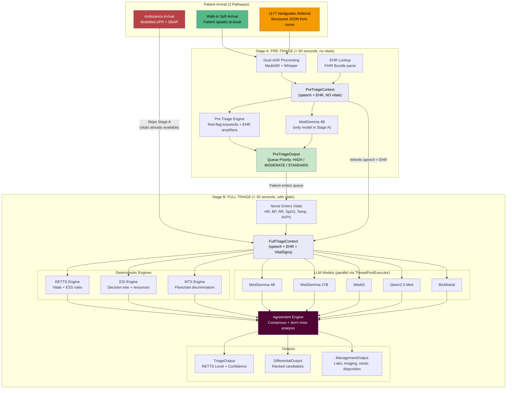

### Stage Model Matrix

| Model | Stage A (Pre-Triage) | Stage B: Triage | Stage B: Differential | Stage B: Management |
|-------|:-------------------:|:---------------:|:--------------------:|:------------------:|
| **MedGemma 4B** | Yes | Yes | Yes | Yes |
| **MedGemma 27B** | -- | Yes | Yes | Yes |
| **Med42** | -- | Yes | Yes | -- |
| **Qwen2.5-Med** | -- | Yes | Yes | -- |
| **BioMistral** | -- | Yes | Yes | -- |
| **RETTS Engine** | -- | Yes | -- | -- |
| **ESI Engine** | -- | Yes | -- | -- |
| **MTS Engine** | -- | Yes | -- | -- |
| **Pre-Triage Engine** | Yes | -- | -- | -- |

### Data Flow Between Stages

```
PreTriageContext                    FullTriageContext
  .patient_id                        .patient_id         (inherited)
  .arrival_pathway                   .arrival_pathway     (inherited)
  .arrival_time                      .arrival_time        (inherited)
  .speech_text                       .speech_text         (inherited)
  .ehr (Optional[EHRSnapshot])       .ehr                 (inherited)
  .asr_disagreements                 .asr_disagreements   (inherited)
  .language                          .language            (inherited)
  (NO vitals field)                  .vitals              (REQUIRED - VitalSigns)
                                     .ess_category        (from pre-triage hint)
```

`FullTriageContext` inherits from `PreTriageContext` via Python class inheritance, adding the required `vitals: VitalSigns` field and the optional `ess_category` hint from Stage A.

---

## 3. User Journey Sequence Diagrams

### a. Patient Walk-in Kiosk Flow

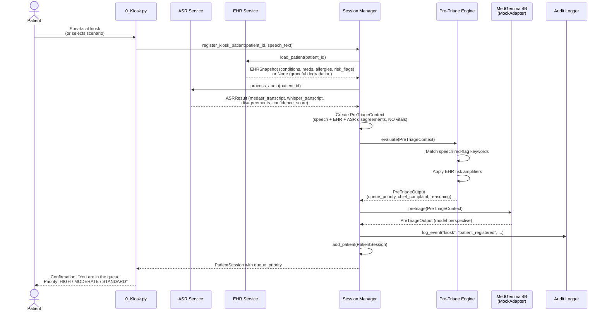

### b. Triage Nurse Flow

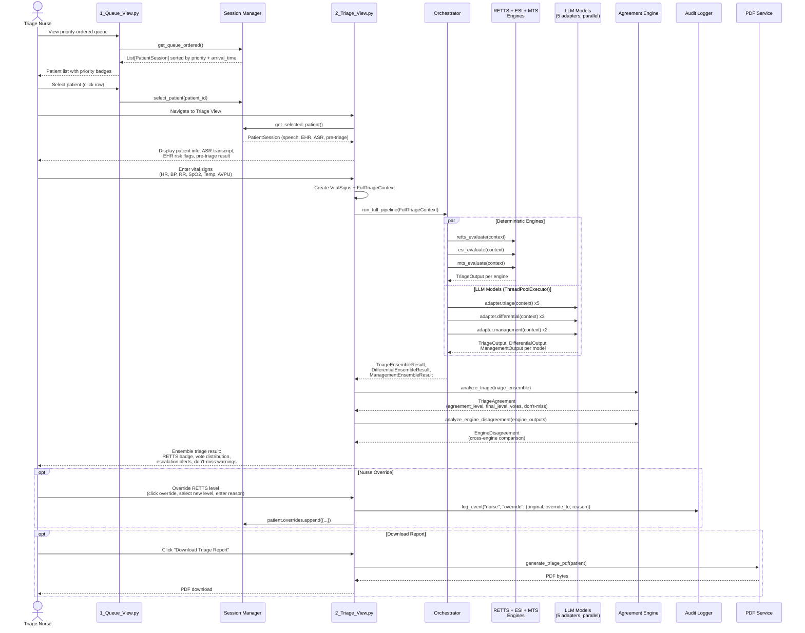

### c. Physician Flow

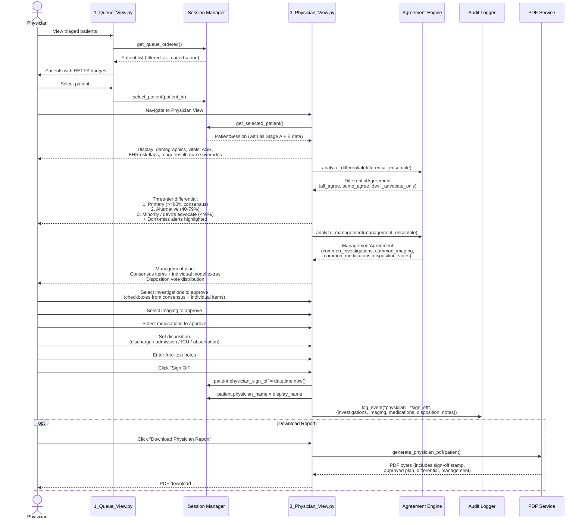

### d. Admin Flow

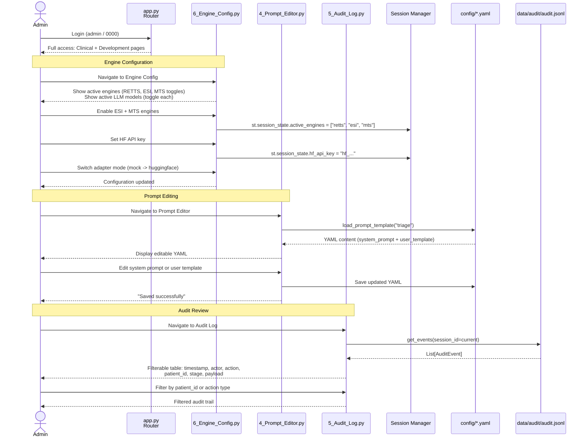

---

## 4. Ensemble Pipeline Sequence Diagram

This diagram shows the detailed internal flow of the Stage B ensemble, including all models and engines running in parallel.

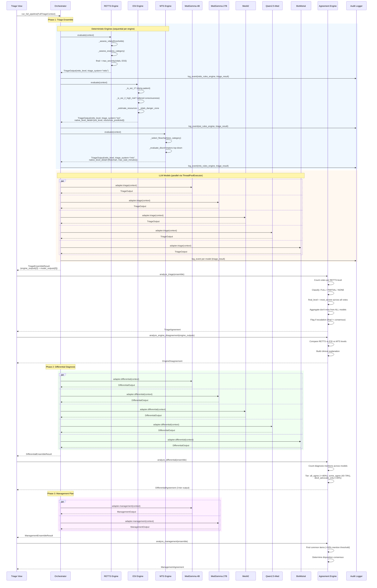

---

## 5. Data Model Diagram

All data models are Pydantic classes defined in `src/models/`. The key architectural decision is the type-enforced stage separation: `PreTriageContext` has no vitals field, while `FullTriageContext` extends it with a required `VitalSigns` field.

### Class Diagram

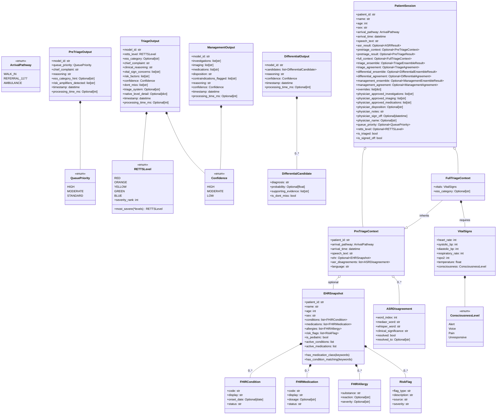

---

## 6. Adapter Pattern Architecture

All AI models implement the `ModelAdapter` protocol. The `AdapterFactory` reads `config/models.yaml` and creates one of three adapter types: `MockAdapter` (loads JSON from `data/scenarios/`), `HFBaseAdapter` subclass (calls HuggingFace Inference API), or `SpaceBaseAdapter` subclass (calls HuggingFace Spaces via Gradio client). Swapping is a config change, not a code change.

### Adapter Class Hierarchy

```mermaid
classDiagram
    direction TB

    class ModelAdapter {
        <<protocol>>
        +model_id: str
        +model_name: str
        +supported_stages: list[str]
        +pretriage(PreTriageContext) PreTriageOutput
        +triage(FullTriageContext) TriageOutput
        +differential(FullTriageContext) DifferentialOutput
        +management(FullTriageContext) ManagementOutput
    }

    class BaseAdapter {
        <<abstract>>
        -_model_id: str
        -_model_name: str
        -_supported_stages: list[str]
        +pretriage() raises NotImplementedError
        +triage() raises NotImplementedError
        +differential() raises NotImplementedError
        +management() raises NotImplementedError
    }

    class MockAdapter {
        +pretriage(context) PreTriageOutput
        +triage(context) TriageOutput
        +differential(context) DifferentialOutput
        +management(context) ManagementOutput
        -_load_scenario(patient_id, stage) dict
        -_default_pretriage() PreTriageOutput
        -_default_triage() TriageOutput
    }

    class HFBaseAdapter {
        <<abstract>>
        -_hf_model_id: str
        -_timeout_seconds: int
        -_max_tokens: int
        -_client: InferenceClient
        +pretriage(context) PreTriageOutput
        +triage(context) TriageOutput
        +differential(context) DifferentialOutput
        +management(context) ManagementOutput
        -_chat_completion(messages) str
        -_parse_pretriage(raw, ms) PreTriageOutput
        -_parse_triage(raw, ms) TriageOutput
        -_parse_differential(raw, ms) DifferentialOutput
        -_parse_management(raw, ms) ManagementOutput
    }

    class MedGemma4BAdapter {
        hf_model_id: google/medgemma-4b-it
        stages: pretriage, triage, differential, management
        max_tokens: 2048
    }

    class MedGemma27BAdapter {
        hf_model_id: google/medgemma-27b-text-it
        stages: triage, differential, management
        max_tokens: 4096
    }

    class Med42Adapter {
        hf_model_id: m42-health/Llama3-Med42-8B
        stages: triage, differential
        max_tokens: 2048
    }

    class QwenMedAdapter {
        hf_model_id: wanglab/Qwen2.5-Med-7B
        stages: triage, differential
        max_tokens: 2048
    }

    class BioMistralAdapter {
        hf_model_id: BioMistral/BioMistral-7B
        stages: triage, differential
        max_tokens: 2048
    }

    class SpaceBaseAdapter {
        <<abstract>>
        -_space_id: str
        -_api_name: str
        -_client: gradio_client.Client
        -_chat_completion(messages) str
        -_flatten_messages(messages) str
        -_get_client() Client
    }

    class SpaceMedGemma4BAdapter {
        space_id: eduillueca/HumanInTheLoopTriage
        api_name: /predict
        stages: pretriage, triage, differential, management
    }

    class AdapterFactory {
        +create_adapter(model_id) BaseAdapter
        +create_all_adapters() dict
        +create_stage_adapters(stage) dict
        -_build_adapter(model_id, config) BaseAdapter
        -_build_hf_adapter(model_id, ...) BaseAdapter
        -_build_space_adapter(model_id, ...) BaseAdapter
    }

    class PromptBuilder {
        +build_pretriage_prompt(ctx) list[dict]
        +build_triage_prompt(ctx, model_id) list[dict]
        +build_differential_prompt(ctx, model_id) list[dict]
        +build_management_prompt(ctx, model_id) list[dict]
    }

    ModelAdapter <|.. BaseAdapter : implements
    BaseAdapter <|-- MockAdapter
    BaseAdapter <|-- HFBaseAdapter
    HFBaseAdapter <|-- MedGemma4BAdapter
    HFBaseAdapter <|-- MedGemma27BAdapter
    HFBaseAdapter <|-- Med42Adapter
    HFBaseAdapter <|-- QwenMedAdapter
    HFBaseAdapter <|-- BioMistralAdapter
    HFBaseAdapter <|-- SpaceBaseAdapter : inherits parsing
    SpaceBaseAdapter <|-- SpaceMedGemma4BAdapter

    AdapterFactory ..> MockAdapter : creates
    AdapterFactory ..> HFBaseAdapter : creates
    AdapterFactory ..> SpaceBaseAdapter : creates
    AdapterFactory ..> "config/models.yaml" : reads

    HFBaseAdapter ..> PromptBuilder : uses
    PromptBuilder ..> "config/prompts/*.yaml" : reads

    MockAdapter ..> "data/scenarios/" : reads JSON
```

### Config-Driven Switching

The `config/models.yaml` file controls which adapter type is instantiated for each model:

```yaml
# To switch MedGemma 4B from mock to live inference:
medgemma_4b:
  adapter: "mock"          # Change to "huggingface" or "space"
  hf_id: "google/medgemma-4b-it"
  space_id: "eduillueca/HumanInTheLoopTriage"  # Used only when adapter: "space"
  api_name: "/predict"                          # Gradio endpoint name
  stages: ["pretriage", "triage", "differential", "management"]
```

The factory uses lazy imports for HF and Space adapters to avoid pulling in `huggingface_hub` or `gradio_client` when running in mock mode:

```
AdapterFactory._build_adapter()
  |
  +-- adapter_type == "mock"          --> MockAdapter(model_id, model_name, stages)
  |
  +-- adapter_type == "huggingface"   --> importlib.import_module(module_path)
  |                                       HF adapter class via InferenceClient
  |
  +-- adapter_type == "space"         --> importlib.import_module(module_path)
  |                                       Space adapter class via gradio_client.Client
  |
  +-- adapter_type == "deterministic" --> Skipped (engines, not adapters)
```

The Space adapter (`SpaceBaseAdapter`) inherits all response parsing logic from `HFBaseAdapter`, overriding only the transport layer (`_get_client()` and `_chat_completion()`). It flattens the chat messages array into a single prompt string for the Gradio `/predict` endpoint.

### Mock Adapter File Lookup

```
data/scenarios/{patient_id}/{stage}/{model_id}.json

Example:
  data/scenarios/anders/triage/medgemma_4b.json
  data/scenarios/ella/differential/biomistral.json
```

If no scenario file exists, the MockAdapter returns a default response with `Confidence.LOW`.

---

## 7. Agreement Engine Logic

The Agreement Engine (`src/engines/agreement_engine.py`) implements the MEDLEY framework's core principle: **disagreement is preserved as a clinical resource, not collapsed into consensus**.

### Triage Agreement Flowchart

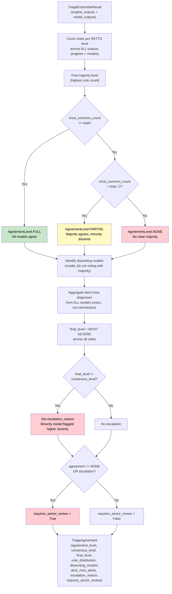

### Cross-Engine Disagreement Analysis

When multiple deterministic engines are active (RETTS, ESI, MTS), the `analyze_engine_disagreement()` function compares their outputs and explains *why* different triage philosophies disagree:

| Scenario | RETTS | ESI | MTS | Clinical Meaning |
|----------|-------|-----|-----|-----------------|
| All agree on ORANGE | ORANGE | ORANGE | ORANGE | High confidence; proceed with standard workflow |
| ESI higher than RETTS | YELLOW | ORANGE | YELLOW | ESI's resource-prediction flagged higher acuity |
| MTS higher than others | GREEN | GREEN | ORANGE | MTS discriminator caught a sign others missed |
| All disagree | YELLOW | ORANGE | RED | Different philosophies see different risk; senior review mandatory |

### Differential Three-Tier Output

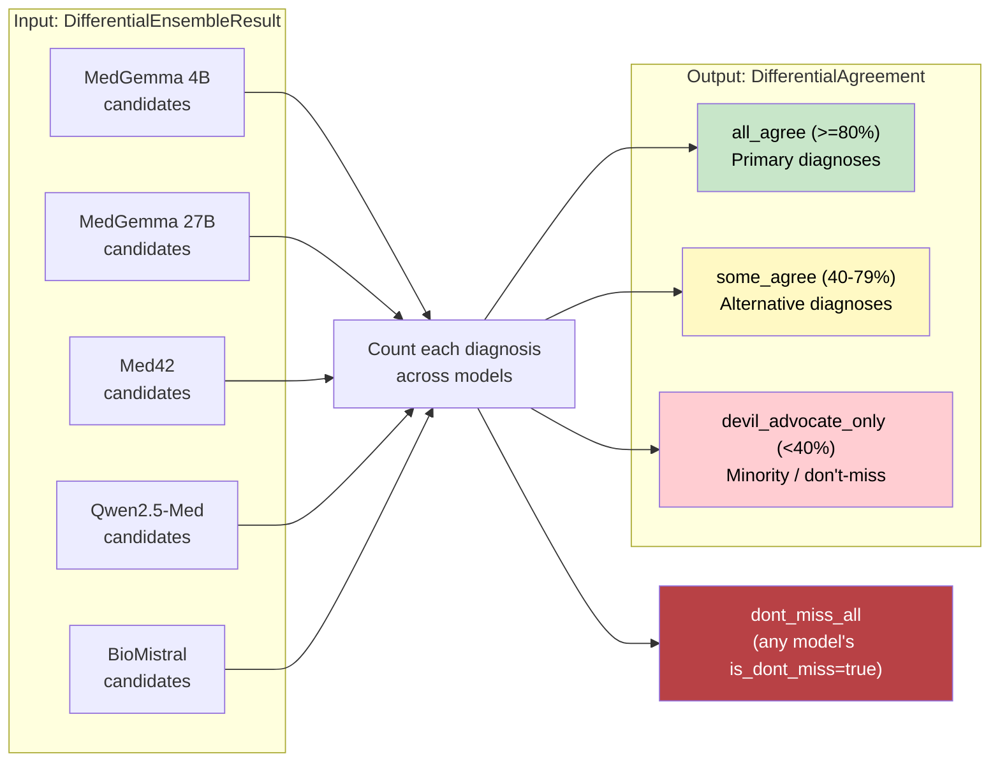

### Don't-Miss Alert Propagation

The don't-miss mechanism ensures that even a single model's safety concern is surfaced:

1. **TriageOutput.dont_miss**: Each model/engine can flag don't-miss diagnoses in their output
2. **DifferentialCandidate.is_dont_miss**: Individual differential candidates can be flagged
3. **TriageAgreement.dont_miss_alerts**: Union of all don't-miss from all models (not discarded even if only 1/8 flagged it)
4. **DifferentialAgreement.dont_miss_all**: Aggregated from all models' candidates where `is_dont_miss=True`
5. **UI**: Don't-miss items are displayed with red highlighting regardless of where they appear in the agreement tiers

---

## 8. ASR Disagreement Pipeline

Based on the "From Black Box to Glass Box" research, the ASR pipeline runs two independent speech recognition models and uses their disagreement as a quality signal.

### Sequence Diagram

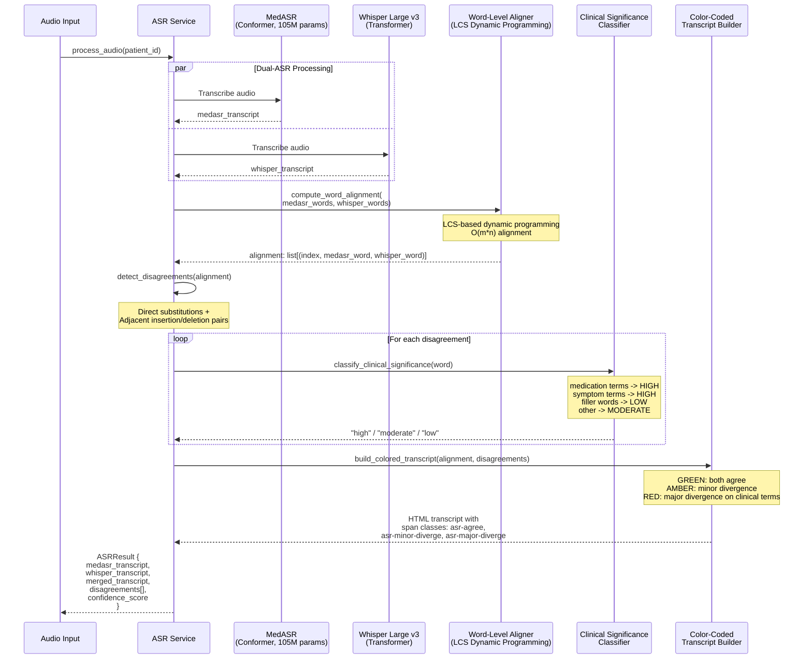

### Clinical Significance Weighting

| Category | Weight | Examples | Disagreement Color |
|----------|--------|---------|-------------------|
| **Medication** | 1.0 | warfarin, metoprolol, ibuprofen | RED |
| **Dosage** | 1.0 | 5mg, 100ml | RED |
| **Symptom** | 0.8 | pain, fever, bleeding, dizzy | RED |
| **Anatomy** | 0.7 | chest, head, abdomen | AMBER/RED |
| **Temporal** | 0.5 | yesterday, 3 days ago | AMBER |
| **Qualifier** | 0.4 | severe, mild, worse | AMBER |
| **Filler** | 0.1 | um, uh, like, so | (ignored) |
| **Default** | 0.3 | Other words | AMBER |

The system maintains explicit lookup sets for medication terms (42 entries: warfarin, waran, metformin, metoprolol, etc.) and symptom terms (26 entries in both English and Swedish: pain/smartra, fever/feber, etc.).

### Example: Anders Scenario

```
MedASR:  "...I take warfarin and metoprolol..."
Whisper: "...I take waran and metoprolol..."
                     ^^^^^^^^   ^^^^^^^^^^
                     RED         GREEN
                  (high significance:
                   medication term disagrees)

Resolution: EHR confirms warfarin prescription -> resolved_to = "warfarin"
```

---

## 9. Role-Based Access Control

Authentication uses a mock credential system (`src/services/auth_service.py`) with four roles. In production, this would connect to hospital SSO/LDAP.

### Role Hierarchy and Page Access

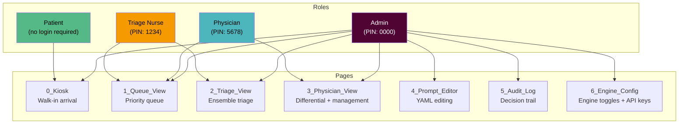

### Access Matrix

| Page | Patient | Triage Nurse | Physician | Admin |
|------|:-------:|:------------:|:---------:|:-----:|
| **Kiosk** | Yes | -- | -- | Yes |
| **Queue View** | -- | Yes | Yes | Yes |
| **Triage View** | -- | Yes | -- | Yes |
| **Physician View** | -- | -- | Yes | Yes |
| **Prompt Editor** | -- | -- | -- | Yes |
| **Audit Log** | -- | -- | -- | Yes |
| **Engine Config** | -- | -- | -- | Yes |

### Demo Credentials

| Username | PIN | Role | Display Name |
|----------|-----|------|-------------|
| `nurse_anna` | `1234` | Triage Nurse | Anna Lindberg, RN |
| `nurse_erik` | `1234` | Triage Nurse | Erik Holm, RN |
| `dr_nilsson` | `5678` | Physician | Dr. Sara Nilsson |
| `dr_berg` | `5678` | Physician | Dr. Magnus Berg |
| `admin` | `0000` | Admin | System Admin |

### Navigation Flow

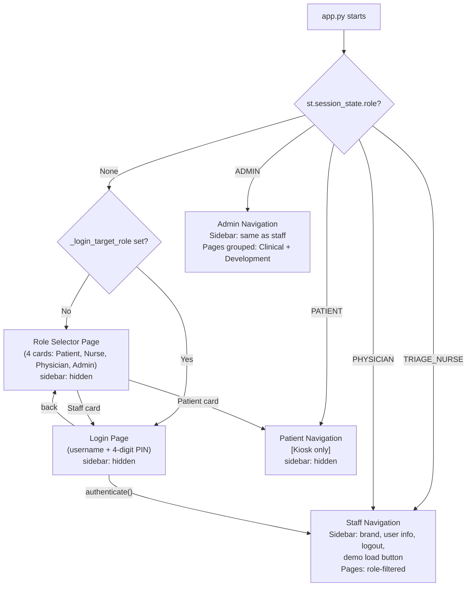

---

## 10. Source Code Layout

```
triage-medley/
|
|-- app.py                              # Streamlit entry point: role selector, login, st.navigation() router
|-- CLAUDE.md                           # Project instructions for Claude Code (build commands, architecture, conventions)
|
|-- config/
|   |-- models.yaml                     # Model registry: adapter type (mock|huggingface|space), HF IDs, Space IDs, stages
|   |-- engines.yaml                    # Engine registry: RETTS/ESI/MTS descriptions, philosophies, defaults
|   |-- pretriage.yaml                  # Pre-triage rules: red-flag keywords, priority mappings, risk amplifiers
|   |-- prompts/
|   |   |-- pretriage.yaml              # Stage A prompt template: system_prompt + user_template
|   |   |-- triage.yaml                # Stage B triage prompt template
|   |   |-- differential.yaml          # Differential diagnosis prompt template
|   |   |-- management.yaml            # Management plan prompt template
|   |-- retts/
|   |   |-- ess_codes.json             # ESS category definitions and default severity levels
|   |   |-- vitals_cutoffs.json        # Age-stratified vital sign thresholds (adult + pediatric)
|   |-- esi/
|   |   |-- decision_tree.json         # ESI decision criteria: ESI-1/2 thresholds, danger zone, intervention keywords
|   |   |-- resource_rules.json        # Resource estimation rules per ESS category
|   |-- mts/
|       |-- flowcharts.json            # MTS complaint-specific flowcharts with discriminators
|       |-- general_discriminators.json # MTS fallback discriminators
|
|-- src/
|   |-- __init__.py
|   |
|   |-- models/                         # Pydantic data classes (Layer 0: Data Types)
|   |   |-- __init__.py                 # Re-exports all models
|   |   |-- enums.py                    # RETTSLevel, QueuePriority, Confidence, ArrivalPathway, ConsciousnessLevel
|   |   |-- vitals.py                   # VitalSigns (HR, BP, RR, SpO2, Temp, AVPU)
|   |   |-- clinical.py                # FHIRCondition, FHIRMedication, FHIRAllergy, RiskFlag, EHRSnapshot,
|   |   |                              # Symptom, ASRDisagreement
|   |   |-- context.py                 # PreTriageContext (no vitals), FullTriageContext (inherits + requires vitals)
|   |   |-- outputs.py                 # PreTriageOutput, TriageOutput, DifferentialCandidate, DifferentialOutput,
|   |                                  # ManagementOutput
|   |
|   |-- adapters/                       # Model Adapter pattern (Layer 1: Model Interface)
|   |   |-- __init__.py
|   |   |-- base.py                     # ModelAdapter protocol + BaseAdapter abstract class
|   |   |-- mock_adapter.py             # MockAdapter: loads JSON from data/scenarios/{patient_id}/{stage}/{model_id}.json
|   |   |-- factory.py                  # AdapterFactory: reads models.yaml, creates mock, HF, or Space adapters
|   |   |-- prompt_builder.py           # Renders YAML prompt templates with clinical context for HF/Space adapters
|   |   |-- hf_base.py                  # HFBaseAdapter: InferenceClient, chat_completion, JSON extraction, response parsers
|   |   |-- hf_medgemma.py              # MedGemma4BAdapter + MedGemma27BAdapter (inherits HFBaseAdapter)
|   |   |-- hf_ensemble.py              # Med42Adapter + QwenMedAdapter + BioMistralAdapter (inherits HFBaseAdapter)
|   |   |-- space_base.py               # SpaceBaseAdapter: gradio_client, predict, inherits parsing from HFBaseAdapter
|   |   |-- space_medgemma.py            # SpaceMedGemma4BAdapter (inherits SpaceBaseAdapter)
|   |
|   |-- engines/                        # Deterministic Triage Engines (Layer 2: Clinical Rules)
|   |   |-- __init__.py
|   |   |-- pretriage_engine.py         # Stage A: speech red-flag matching + EHR risk amplification -> QueuePriority
|   |   |-- retts_engine.py             # RETTS: vitals thresholds + ESS codes -> higher of two -> RETTS colour
|   |   |-- esi_engine.py               # ESI: 5-level decision tree (dying? high-risk? resources? danger zone?)
|   |   |-- mts_engine.py              # MTS: complaint-specific flowchart -> top-down discriminator walk
|   |   |-- agreement_engine.py         # Ensemble consensus: TriageAgreement, EngineDisagreement,
|   |                                   # DifferentialAgreement (3-tier), ManagementAgreement
|   |
|   |-- services/                       # Application Services (Layer 3: Orchestration)
|   |   |-- __init__.py
|   |   |-- orchestrator.py             # Parallel model dispatch (ThreadPoolExecutor), run_pretriage,
|   |   |                               # run_triage_ensemble, run_differential_ensemble, run_management_ensemble,
|   |   |                               # run_full_pipeline
|   |   |-- ehr_service.py              # FHIR Bundle parser, risk flag computation (9 rules: anticoagulation,
|   |   |                               # cardiac polypharmacy, immunosuppression, beta-blocker masking, etc.)
|   |   |-- asr_service.py              # Dual-ASR: LCS word alignment, clinical significance classification,
|   |   |                               # color-coded transcript builder, mock data for 6 scenarios
|   |   |-- auth_service.py             # Role enum, ROLE_PAGES access matrix, DEMO_CREDENTIALS, authenticate()
|   |   |-- pdf_service.py              # MedleyPDF (fpdf2): triage + physician reports, KI branding, RETTS badges
|   |   |-- session_manager.py          # PatientSession dataclass, Streamlit session state management,
|   |                                   # register_kiosk_patient(), load_demo_scenarios()
|   |
|   |-- utils/                          # Shared Utilities (Layer 4: Infrastructure)
|       |-- __init__.py
|       |-- config.py                   # YAML/JSON config loader with caching, path helpers
|       |-- audit.py                    # Thread-safe JSONL audit logger, AuditEvent model, filtering queries
|       |-- theme.py                    # KI color constants, custom CSS injection, footer rendering
|
|-- pages/                              # Streamlit Multi-Page App (Layer 5: HITL Visualization)
|   |-- 0_Kiosk.py                      # Patient walk-in: ID entry / scenario selection -> Stage A pipeline
|   |-- 1_Queue_View.py                 # Charge nurse: priority-ordered queue, patient selection, status badges
|   |-- 2_Triage_View.py               # Triage nurse: vitals entry, ensemble result, vote distribution,
|   |                                   # cross-engine comparison, nurse override, PDF download
|   |-- 3_Physician_View.py            # Physician: 3-tier differential, management plan, approve/modify,
|   |                                   # sign-off, PDF download
|   |-- 4_Prompt_Editor.py             # Admin: live YAML prompt template editing
|   |-- 5_Audit_Log.py                 # Admin: filterable audit trail viewer
|   |-- 6_Engine_Config.py             # Admin: toggle engines (RETTS/ESI/MTS), toggle LLM models,
|                                       # set HF API key, test Inference API / Space connection
|
|-- data/
|   |-- scenarios/                      # Mock JSON responses per patient per stage per model
|   |   |-- anders/                     # 68M, chest tightness (consensus scenario)
|   |   |   |-- pretriage/              # medgemma_4b.json
|   |   |   |-- triage/                 # medgemma_4b.json, medgemma_27b.json, med42.json, qwen_med.json, biomistral.json
|   |   |   |-- differential/           # (same models)
|   |   |   |-- management/             # medgemma_4b.json, medgemma_27b.json
|   |   |-- ella/                       # 4F, fever + rash (don't-miss: meningococcal)
|   |   |-- margit/                     # 81F, fall on warfarin (EHR escalation)
|   |   |-- ingrid/                     # 79F, hidden urosepsis (deceptive vitals)
|   |   |-- erik/                       # 72M, TIA + melena (aortic dissection)
|   |   |-- sofia/                      # 28F, pulled muscle (bilateral PE)
|   |
|   |-- ehr/                            # Synthea FHIR R4 Bundles (6 synthetic patients)
|   |   |-- anders.json
|   |   |-- ella.json
|   |   |-- margit.json
|   |   |-- ingrid.json
|   |   |-- erik.json
|   |   |-- sofia.json
|   |
|   |-- audit/
|       |-- audit.jsonl                 # Append-only audit log (auto-created)
|
|-- tests/
|   |-- __init__.py
|   |-- test_models.py                  # Pydantic model tests (validation, type enforcement)
|   |-- test_pretriage.py               # Pre-triage engine tests
|   |-- test_retts.py                   # RETTS engine tests
|   |-- test_esi.py                     # ESI engine tests
|   |-- test_mts.py                     # MTS engine tests
|   |-- test_ehr.py                     # EHR service tests (FHIR parsing, risk flags)
|   |-- test_audit.py                   # Audit logger tests
|   |-- test_adapters.py               # Mock adapter tests
|   |-- test_hf_adapters.py            # HuggingFace Inference API adapter tests
|   |-- test_space_adapters.py         # HuggingFace Space adapter tests
|   |-- test_multi_engine.py           # Multi-engine orchestration + agreement tests
|   |-- test_pipeline.py               # End-to-end pipeline integration tests
|   |-- test_auth.py                   # Authentication + RBAC tests
|   |-- test_pdf.py                    # PDF generation tests
|
|-- ref/                                # Reference documentation
|-- presentation/                       # Presentation assets
|-- docs/
    |-- ARCHITECTURE.md                 # This file
```

### Key File Counts

| Directory | Files | Purpose |
|-----------|------:|---------|
| `src/models/` | 5 | Pydantic data classes |
| `src/adapters/` | 9 | Model adapter protocol + implementations (mock, HF, Space) |
| `src/engines/` | 5 | Deterministic engines + agreement analysis |
| `src/services/` | 6 | Application services (orchestration, EHR, ASR, auth, PDF, session) |
| `src/utils/` | 3 | Config, audit, theme |
| `pages/` | 7 | Streamlit UI pages |
| `config/` | 11+ | YAML/JSON clinical rules and prompt templates |
| `data/scenarios/` | ~60 | Mock JSON responses (6 patients x 4 stages x ~2-5 models) |
| `data/ehr/` | 6 | Synthetic FHIR patient bundles |
| `tests/` | 13 | Unit + integration tests |

---

*Document generated from source code analysis of the Triage-Medley repository.*
*Last updated: February 2026.*
